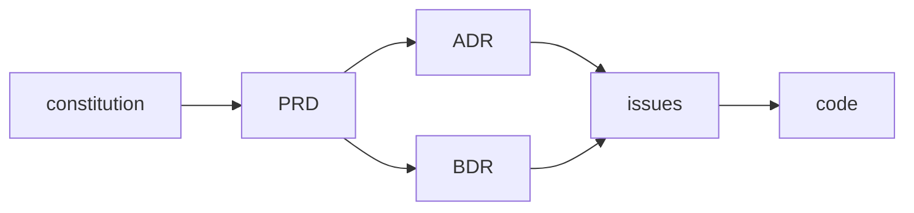

# Living Docs

**Run a project's documentation as a living system — not a write-once artifact that rots.**

[](LICENSE)
[](skills/okf-knowledge-format/reference/SPEC.md)
[](#whats-in-the-box)

Living Docs is an **agent skill** (works with Claude Code and any harness that
loads markdown "skills") that keeps a codebase's documentation in sync with its
code. It is stack-agnostic: it governs *how* docs are organized and maintained,
never *what* technology a project uses.

The whole discipline collapses to one spine:

> **Every piece of knowledge has exactly one home, that home is indexed, and
> nothing structural ships without its doc.**

Everything else — the constitution, ADRs, BDRs, PRDs, issues, research notes,
architecture diagrams, and the semantic context index — hangs off that spine.

---

## Why this exists

Most documentation rots because there is no contract keeping it honest. Living
Docs adds five governance invariants that an agent (or a human) can re-derive
every action from:

1. **Docs-first.** Author the body in the repo (`docs/…`) *before* publishing
   to any tracker or wiki. The repo file is the source of truth; the external
   copy is a mirror.
2. **One home per fact.** Each concept, decision, or requirement lives in
   exactly one file. Cross-reference instead of copying — duplicated prose is
   drift waiting to happen.
3. **Indexed or it doesn't exist.** Every doc is reachable from an `index.md`.
   No orphan files.
4. **Supersede, never rewrite history.** Decisions and requirements are
   append-only. When something changes, mark the old record superseded and
   write a new one — never silently edit the past.
5. **No structural change without its doc.** New module, moved files, schema
   change, new data flow → update the relevant doc *and its diagram* in the
   same change. No "I'll document it later."

These invariants are carried **in YAML frontmatter as a fact contract**, which
is the genuinely unusual part — see [Provenance](#provenance--honest-attribution).

---

## The doc trail

Every change follows one chain, from the foundational source of truth down to
code:



| Artifact | Role |
|---|---|
| **constitution** | Foundational source of truth: what the product is, core data model, non-negotiables. |
| **PRD** | What the system must do and why — feature/product requirement spec. |
| **ADR** | How the system is structured — architectural/implementation decision and rationale. |
| **BDR** | What the system must observably do — inputs, outputs, side effects, Given/When/Then scenarios. |
| **issues** | Execution slices — discrete units of work that trace back to ADRs/BDRs. |
| **code** | Implementation — every behavior, structure, and interface specified above, realized. |

---

## What's in the box

This repo bundles the Living Docs skill together with its two composition
dependencies and the prior-art research that backs its honesty claims:

| Path | What it is |
|---|---|
| [`skills/living-docs/`](skills/living-docs/) | The skill: the five invariants, the doc trail, per-doc-type conventions (`rules/`) and starter templates (`templates/`). |
| [`skills/okf-knowledge-format/`](skills/okf-knowledge-format/) | The **format** standard the docs use — Open Knowledge Format (OKF): markdown + YAML frontmatter, required `type`, reserved `index.md`/`log.md`, bundle-relative links. The OKF spec is **vendored verbatim** from Google Cloud Platform. |
| [`skills/research-artifacts/`](skills/research-artifacts/) | The research-note format and source discipline that feeds ADRs/PRDs (the `docs/research/` half of the trail). |
| [`references/prior-art-landscape.md`](references/prior-art-landscape.md) | The sourced prior-art analysis. Living Docs is **§2** of this broader study of the system it came from; it is included so every "credit, not invention" claim has a checkable citation. |

Each skill is self-describing — open its `SKILL.md` for the full operational
detail. Living Docs and OKF compose but do not overlap: **Living Docs governs
*which* docs exist and the no-drift discipline; OKF governs *how* a knowledge
bundle's markdown and frontmatter are shaped.**

---

## Installation

These are plain **markdown instruction files** — there is nothing to compile.
Every agent tool loads instructions from a slightly different place, so installing
Living Docs is always the same idea: **put the three `skills/` directories where
your tool discovers instructions, then start a fresh session.** Clone once:

```bash
git clone https://github.com/ejklock/living-docs-skill.git
cd living-docs-skill
```

Then follow the section for your tool.

### Claude Code

Native skills support — drop the directories into the skills folder
(`~/.claude/skills` global, or `.claude/skills` per project):

```bash
./install.sh                    # installs the 3 skills to ~/.claude/skills
./install.sh .claude/skills     # or per-project
```

Restart the session. Claude Code auto-discovers each `SKILL.md` and invokes it on
the triggers in its `description`.

### OpenCode

OpenCode auto-loads `AGENTS.md` (global `~/.config/opencode/AGENTS.md`, or one at
the project root). Copy the skills and reference them from `AGENTS.md`:

```bash
mkdir -p ~/.config/opencode/skills
cp -R skills/* ~/.config/opencode/skills/
```

Then append to `~/.config/opencode/AGENTS.md` (or the project `AGENTS.md`):

```markdown
## Living Docs
Follow the documentation discipline in skills/living-docs/SKILL.md,
skills/okf-knowledge-format/SKILL.md, and skills/research-artifacts/SKILL.md.
```

### Pi

Pi reads project/agent instructions from `AGENTS.md` and its agent directory
(`~/.pi/agent/`). Same pattern as OpenCode — copy the skills and point Pi's
instructions at them:

```bash
mkdir -p ~/.pi/agent/skills
cp -R skills/* ~/.pi/agent/skills/
```

Add a pointer in your Pi `AGENTS.md` / system instructions referencing the three
`SKILL.md` files above.

### GitHub Copilot

Copilot reads repo custom instructions from `.github/`. Use a path-scoped
instruction file so it applies when touching docs:

```bash
mkdir -p .github/instructions
cp skills/living-docs/SKILL.md .github/instructions/living-docs.instructions.md
```

Add an `applyTo` header at the top of that file so Copilot scopes it:

```markdown
---
applyTo: "docs/**,**/*.md"
---
```

For a repo-wide rule instead, append the same guidance to
`.github/copilot-instructions.md`. (The `rules/` and `templates/` files stay in
the cloned repo for reference.)

### Cursor

Cursor loads project rules from `.cursor/rules/*.mdc`. Add Living Docs as a rule:

```bash
mkdir -p .cursor/rules
cp skills/living-docs/SKILL.md .cursor/rules/living-docs.mdc
```

Give the `.mdc` file a Cursor rule header so it activates on doc work:

```markdown
---
description: Living Docs — keep documentation a living system (ADR/BDR/PRD/constitution, no-drift invariants)
globs: docs/**,**/*.md
alwaysApply: false
---
```

### Any other tool

Copy `skills/living-docs/`, `skills/okf-knowledge-format/`, and
`skills/research-artifacts/` into wherever that tool loads instructions from, or
just read the `SKILL.md` files — they are plain markdown meant to be read by
humans and agents alike.

---

## When to invoke

- Standing up documentation for a project (`docs/` structure, the docs index,
  ADR/issue/BDR/constitution directories).
- Writing or editing an **ADR**, **PRD**, **BDR**, **constitution**, or
  **issue** → load the matching `rules/` + `templates/` file.
- Recording **research** → the `research-artifacts` skill.
- Drawing or updating an **architecture / data-flow / sequence diagram**
  (living Mermaid, in-repo text that must match the code).
- Defining a **term or acronym** → the glossary, one home per term.
- A doc grew too large or mixes concerns → **split into a semantic index**.
- Enforcing the **no-drift maintenance rule** after any structural change.

---

## Composition with other skills

Living Docs is deliberately small and composes with the rest of your toolchain
rather than absorbing it: design grilling before a load-bearing ADR, an
architecture-improvement pass that reads the context index and ADRs, a
deep-research step that gathers the evidence `research-artifacts` then formats,
and an implementation-review step that checks code honors the ADRs/BDRs. See the
"Composition with other skills" section in
[`skills/living-docs/SKILL.md`](skills/living-docs/SKILL.md) for the full map.

> The design-grilling step composes with **`grill-me`** by
> **Matt Pocock** ([github.com/mattpocock/skills](https://github.com/mattpocock/skills))
> — referenced, not bundled here. See [`ATTRIBUTION.md`](ATTRIBUTION.md).

---

## Provenance — honest attribution

**This work instrumentalizes established practices; it does not invent them.**
"Living documentation" is Cyrille Martraire's named methodology; ADRs are
Michael Nygard's (supersede-don't-delete is the adr-tools convention); BDRs wrap
Specification by Example / BDD (Adzic; North); the file format is Google Cloud
Platform's OKF, vendored verbatim. The only genuinely original part is the
**composition + the governance invariants** carried in frontmatter as a fact
contract.

Full credits and the per-source links are in
[`ATTRIBUTION.md`](ATTRIBUTION.md) and
[`references/prior-art-landscape.md`](references/prior-art-landscape.md).

---

## License

[MIT](LICENSE) © 2026 Evaldo Klock.

Vendored third-party content under `reference/` directories remains subject to
its own upstream license — see [`ATTRIBUTION.md`](ATTRIBUTION.md).
