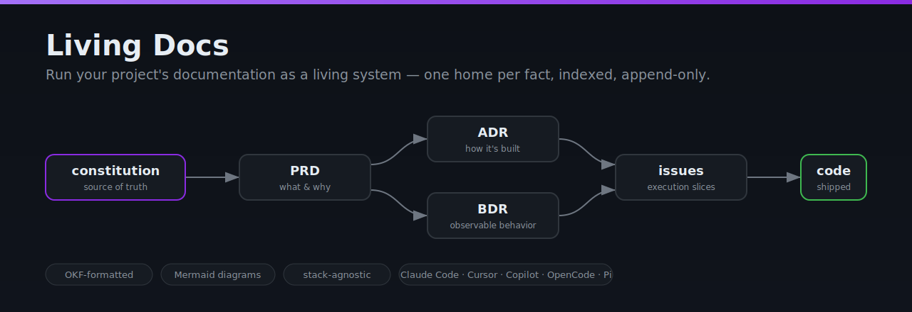
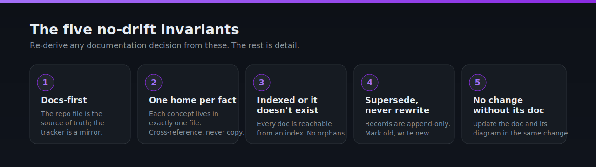
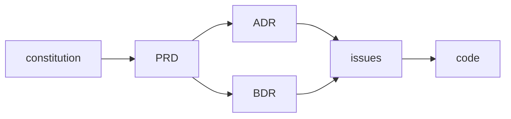

# Living Docs

**Run a project's documentation as a living system — not a write-once artifact that rots.**

[](LICENSE)
[](skills/okf-knowledge-format/reference/SPEC.md)
[](#whats-in-the-box)
[](#installation)



Living Docs is an **AI agent skill** for **documentation-as-code** that keeps a
codebase's docs in sync with its code. It works with **Claude Code**, **Cursor**,
**GitHub Copilot**, **OpenCode**, **Codex**, and **Pi** — any agent that loads
markdown "skills" / instruction files. It is stack-agnostic: it governs *how* docs are
organized and maintained (Architecture Decision Records, Behavior Decision
Records, PRDs, a constitution, a glossary, living
[Mermaid](https://mermaid.js.org/) diagrams), never *what* technology a project
uses.

The whole discipline collapses to one spine:

> **Every piece of knowledge has exactly one home, that home is indexed, and
> nothing structural ships without its doc.**

Everything else — the constitution, ADRs, BDRs, PRDs, issues, research notes,
architecture diagrams, and the semantic context index — hangs off that spine.

---

## Why this exists

Most documentation rots because there is no contract keeping it honest. Living
Docs adds five governance invariants that an agent (or a human) can re-derive
every action from:

1. **Docs-first.** Author the body in the repo (`docs/…`) *before* publishing
   to any tracker or wiki. The repo file is the source of truth; the external
   copy is a mirror.
2. **One home per fact.** Each concept, decision, or requirement lives in
   exactly one file. Cross-reference instead of copying — duplicated prose is
   drift waiting to happen.
3. **Indexed or it doesn't exist.** Every doc is reachable from an `index.md`.
   No orphan files.
4. **Supersede, never rewrite history.** Decisions and requirements are
   append-only. When something changes, mark the old record superseded and
   write a new one — never silently edit the past.
5. **No structural change without its doc.** New module, moved files, schema
   change, new data flow → update the relevant doc *and its diagram* in the
   same change. No "I'll document it later."

These invariants are carried **in YAML frontmatter as a fact contract** and wired
to a deterministic checker (the `living-docs` CLI). The pitch is **not** novelty —
arc42 + ADR + C4 + docs-as-code is a well-trodden stack — it is the **explicit,
agent-enforceable packaging** of it. See [Provenance](#provenance--honest-attribution).



---

## The doc trail

Every change follows one chain, from the foundational source of truth down to
code:



| Artifact | Role |
|---|---|
| **constitution** | Foundational source of truth: what the product is, core data model, non-negotiables. |
| **PRD** | What the system must do and why — feature/product requirement spec. |
| **ADR** | How the system is structured — architectural/implementation decision and rationale. |
| **BDR** | What the system must observably do — inputs, outputs, side effects, Given/When/Then scenarios. |
| **issues** | Execution slices — discrete units of work that trace back to ADRs/BDRs. |
| **code** | Implementation — every behavior, structure, and interface specified above, realized. |

---

## What's in the box

This repo bundles the Living Docs skill together with its two composition
dependencies and the prior-art research that backs its honesty claims:

| Path | What it is |
|---|---|
| [`skills/living-docs/`](skills/living-docs/) | The skill: the five invariants, the doc trail, per-doc-type conventions (`rules/`) and starter templates (`templates/`). |
| [`skills/okf-knowledge-format/`](skills/okf-knowledge-format/) | The **format** standard the docs use — Open Knowledge Format (OKF): markdown + YAML frontmatter, required `type`, reserved `index.md`/`log.md`, bundle-relative links. The OKF spec is **vendored verbatim** from Google Cloud Platform. |
| [`skills/research-artifacts/`](skills/research-artifacts/) | The research-note format and source discipline that feeds ADRs/PRDs (the `docs/research/` half of the trail). |
| [`references/prior-art-landscape.md`](references/prior-art-landscape.md) | The sourced prior-art analysis — every part of Living Docs (the doc trail, the OKF format, the diagrams, the governance invariants) mapped to its established originator, so every "credit, not invention" claim has a checkable citation. |
| [`cli/`](cli/) ([`living-docs check`](cli/)) | The **deterministic checker** for the mechanical invariants — frontmatter/`type`, indexing + reachability, link resolution, supersede integrity. A single self-contained Rust binary: native `serde_yaml` frontmatter parsing and native `pulldown-cmark` link extraction/resolution — no host tools (no lychee/yq/jq) needed. *A constraint without an instrument is a vibe*; this is the instrument. Wire it into CI. Install with `./install.sh cli` or `make cli-install`. |
| [`cli/`](cli/) (`living-docs check --mermaid-only`) | Validates every fenced ```` ```mermaid ```` block **in-process** via the pure-Rust [`merman-core`](https://crates.io/crates/merman-core) parser — the real Mermaid grammar, not a hand-rolled check — and fails with a `file:line` pointer at the first broken diagram. **No Docker, no daemon, no Chromium** ([ADR 0013](docs/adr/0013-mermaid-validation-runs-in-process-via-merman-core-not-a-docker-mermaid-cli-shell-out.md)): the same self-contained binary does it. With no path argument it sweeps every git-tracked `.md` file in the repo. |
| [`examples/linkly/`](examples/linkly/) | A worked, **lint-clean** end-to-end corpus (constitution → PRD → ADR + BDR → issue) for a fictional URL shortener — the discipline shown, not just described, and the fixture CI runs `living-docs check` against. |

Each skill is self-describing — open its `SKILL.md` for the full operational
detail. Living Docs and OKF compose but do not overlap: **Living Docs governs
*which* docs exist and the no-drift discipline; OKF governs *how* a knowledge
bundle's markdown and frontmatter are shaped.**

---

## Installation

The skill is plain **markdown instruction files** — nothing to compile or install to use it. The optional `living-docs` checker is a single self-contained Rust binary with **no host-tool dependencies at all**: native frontmatter and link parsing (no lychee/yq/jq) and — since **v0.6.0** — in-process Mermaid validation via the pure-Rust `merman-core` parser, so `--mermaid-only` **no longer needs Docker**. Install it with `./install.sh cli` or `make cli-install`.
Installing Living Docs always means the same thing: **put the three `skills/`
directories (or a generated rule file) where your tool discovers instructions,
then start a fresh session.** A cross-platform installer and a `Makefile` do this
for every supported tool. Clone once:

```bash
git clone https://github.com/ejklock/living-docs-skill.git
cd living-docs-skill
```

### Quick start — `install.sh` / `make`

```bash
./install.sh                 # Claude Code, global (~/.claude/skills) — the default
./install.sh cursor          # Cursor rule in the current project
./install.sh copilot         # GitHub Copilot instruction in the current project
./install.sh opencode        # OpenCode (~/.config/opencode/skills)
./install.sh codex           # Codex (~/.codex/skills)
./install.sh pi              # Pi (~/.pi/agent/skills + AGENTS.md)
./install.sh all             # every supported harness at once
```

Useful flags: `--project` (install into the current repo instead of the global
user dir), `--dir <path>` (custom skills directory), `--uninstall`, `--dry-run`,
`--help`. The same targets are available via `make`:

```bash
make help            # list every target
make install         # Claude Code, global
make install-cursor  # or install-copilot / install-opencode / install-codex / install-pi / install-all
make project-claude  # install into the current project
make uninstall-all   # remove from every harness
make check           # full gate: version sync · living-docs check the example ·
                     #   validate mermaid · hostile parser fixtures · bash -n all
                     #   scripts · dry-run every harness
make build           # build the living-docs binary natively -> target/release/living-docs
make cli-install     # install the living-docs binary onto PATH (native cargo install)
make test-fixtures   # run the hostile/negative fixtures guarding the parsers
```

### Where each tool loads from

| Tool | Mechanism | Default location (global · `--project`) |
|---|---|---|
| **Claude Code** | native `SKILL.md` skills | `~/.claude/skills` · `.claude/skills` |
| **OpenCode** | native `SKILL.md` skills (also reads `.claude/skills`) | `~/.config/opencode/skills` · `.opencode/skills` |
| **Codex** | native `SKILL.md` skills | `~/.codex/skills` · `.codex/skills` |
| **Cursor** | project rule | `.cursor/rules/living-docs.mdc` (project-scoped) |
| **GitHub Copilot** | path-scoped instruction | `.github/instructions/living-docs.instructions.md` (project-scoped) |
| **Pi** | skills dir + `AGENTS.md` pointer | `~/.pi/agent/skills` · `.pi/skills` |

**Claude Code**, **OpenCode**, and **Codex** share the same model: they
auto-discover folders of `SKILL.md` files from their skills directory, so the
installer just copies the three skills there (OpenCode additionally reads
`.claude/skills`, so a Claude install already covers it). For **Cursor** and
**Copilot** the installer generates the rule/instruction file with the right
frontmatter header (`globs` / `applyTo` scoped to `docs/**` and `**/*.md`) from
`living-docs/SKILL.md`. **Pi** has no native skills directory — after the skills
are copied, reference them once from your `AGENTS.md`:

```markdown
## Living Docs
Follow the documentation discipline in skills/living-docs/SKILL.md,
skills/okf-knowledge-format/SKILL.md, and skills/research-artifacts/SKILL.md.
```

Then restart the session so the tool picks up the skills.

### Skill content — served by the CLI, not copied to disk

Native harnesses (Claude Code, OpenCode, Codex, Pi) only get each skill's slim
`SKILL.md` stub (plus `okf-knowledge-format/reference/`, the vendored spec) — the
full per-doc-type conventions (`rules/`) and starter templates (`templates/`)
travel **inside the `living-docs` binary** ([ADR 0014](docs/adr/0014-the-cli-serves-skill-content-from-an-embedded-corpus-harness-skill-md-files-are-slim-stubs.md))
and are reached with `living-docs skill`, not by reading files off disk:

```bash
living-docs skill --list                          # every embedded skill and its topics
living-docs skill living-docs                      # the full living-docs/SKILL.md body
living-docs skill living-docs --topic adr           # just the adr topic's rules (+ template)
```

Output is **context-aware**: piped or otherwise non-TTY output defaults to minified
single-line JSON (the machine-friendly shape another agent parses); a real terminal
gets human-readable plain text. `--json` and `--plain` override the autodetection in
either direction and are mutually exclusive. This is why a native harness install is
a small, stable footprint on disk while the authoritative detail stays centralized in
one versioned binary — see [ADR 0014](docs/adr/0014-the-cli-serves-skill-content-from-an-embedded-corpus-harness-skill-md-files-are-slim-stubs.md).

### Any other tool

Copy `skills/living-docs/`, `skills/okf-knowledge-format/`, and
`skills/research-artifacts/` into wherever that tool loads instructions from, or
just read the `SKILL.md` files — they are plain markdown meant to be read by
humans and agents alike.

### Companion skills (Matt Pocock) — recommended, not bundled

Living Docs *composes with* but does **not** bundle Matt Pocock's skills. His
`grill-me` (design interview before a load-bearing decision) pairs directly with
Living Docs, and his `to-prd` / `to-issues` are kindred to the PRD/issues
workflow here. They are best installed **straight from the source** so they stay
canonical and up to date — his repo is MIT-licensed, so cloning and using it is
permitted (keep his `LICENSE` notice if you copy files):

```bash
./install.sh pocock          # git clones his repo (default ~/.matt-pocock-skills)
# or by hand:
git clone https://github.com/mattpocock/skills.git
# his repo ships a `setup-matt-pocock-skills` skill that wires them up
```

See [`ATTRIBUTION.md`](ATTRIBUTION.md) for how Living Docs relates to his work.

---

## When to invoke

- Standing up documentation for a project (`docs/` structure, the docs index,
  ADR/issue/BDR/constitution directories).
- Writing or editing an **ADR**, **PRD**, **BDR**, **constitution**, or
  **issue** → load the matching `rules/` + `templates/` file.
- Recording **research** → the `research-artifacts` skill.
- Drawing or updating an **architecture / data-flow / sequence diagram**
  (living Mermaid, in-repo text that must match the code).
- Defining a **term or acronym** → the glossary, one home per term.
- A doc grew too large or mixes concerns → **split into a semantic index**.
- Enforcing the **no-drift maintenance rule** after any structural change.

---

## Composition with other skills

Living Docs is deliberately small and composes with the rest of your toolchain
rather than absorbing it: design grilling before a load-bearing ADR, an
architecture-improvement pass that reads the context index and ADRs, a
deep-research step that gathers the evidence `research-artifacts` then formats,
and an implementation-review step that checks code honors the ADRs/BDRs. See the
"Composition with other skills" section in
[`skills/living-docs/SKILL.md`](skills/living-docs/SKILL.md) for the full map.

> The design-grilling step composes with **`grill-me`** by
> **Matt Pocock** ([github.com/mattpocock/skills](https://github.com/mattpocock/skills))
> — referenced, not bundled here. See [`ATTRIBUTION.md`](ATTRIBUTION.md).

---

## Provenance — honest attribution

**This work instrumentalizes established practices; it does not invent them.**
"Living documentation" is Cyrille Martraire's named methodology; ADRs are
Michael Nygard's (supersede-don't-delete is the adr-tools convention); BDRs wrap
Specification by Example / BDD (Adzic; North); the file format is Google Cloud
Platform's OKF, vendored verbatim; the architecture diagrams are
[Mermaid](https://mermaid.js.org/) (Knut Sveidqvist & the mermaid-js community).
None of the doc types are invented here. What is original is modest and concrete: the
**composition + the governance invariants** carried in frontmatter as a fact contract
**and enforced by a checker** — the *enforcement*, not the *invention*.

Full credits and the per-source links are in
[`ATTRIBUTION.md`](ATTRIBUTION.md) and
[`references/prior-art-landscape.md`](references/prior-art-landscape.md).

---

## Contributing

Issues and PRs welcome — the project dogfoods its own rules. See
[`CONTRIBUTING.md`](CONTRIBUTING.md) for the repo layout, the invariants it holds
itself to, how to refresh the vendored OKF spec, and how to validate a change —
`make check` runs the full gate: version sync, the docs linter, the hostile parser
fixtures, `bash -n` on every script, and a dry-run of every installer.

---

## FAQ

**What is an "agent skill"?**
A skill is a folder of markdown instructions (a `SKILL.md` plus optional `rules/`
and `templates/`) that an AI coding agent loads and follows. Living Docs is a
skill that teaches the agent how to keep documentation in sync with code.

**Which tools does Living Docs work with?**
Claude Code, OpenCode, and Codex (native `SKILL.md` skills), Cursor
(`.cursor/rules`), GitHub Copilot (`.github/instructions`), and Pi (`AGENTS.md`).
Because the skill is plain markdown, any agent that reads instruction files can
use it. See [Installation](#installation).

**How is this different from a documentation generator or a wiki?**
Living Docs is not a generator and not a hosting tool. It is a *discipline* — five
no-drift governance invariants plus a doc trail (constitution → PRD → ADR + BDR →
issues → code). The agent **follows** the discipline as it works; a deterministic
checker (`living-docs check`) **verifies** the mechanical half when you wire it into
CI or the agent's loop. Prompt-level guidance plus a machine check — not one
pretending to be the other. Your docs live in the repo, in Git, next to the code.

**What is an ADR / BDR / PRD?**
An **ADR** (Architecture Decision Record) captures *how* the system is structured
and why. A **BDR** (Behavior Decision Record) captures *what* the system must
observably do (Given/When/Then). A **PRD** captures the product/feature
requirements. Each has a convention file and a starter template under
[`skills/living-docs/`](skills/living-docs/).

**What is OKF (Open Knowledge Format)?**
A vendor-neutral format from Google Cloud Platform — markdown with YAML
frontmatter, a required `type`, reserved `index.md`/`log.md`, and bundle-relative
links. Living Docs stores every doc as an OKF concept so the corpus stays
portable and agent-parseable. The spec is vendored under
[`skills/okf-knowledge-format/`](skills/okf-knowledge-format/).

**What does the `living-docs check` checker catch — and not catch?**
It is a deterministic checker over a *documented input shape*, not a general markdown/YAML validator, and its three fragile parsers (link extraction, link resolution, frontmatter reading) are guarded by hostile/negative fixtures (`make test-fixtures`). One known limit: the **structural-graph** checks — directory-index membership and index reachability — read only **inline** links in `index.md`, so a file indexed *solely* via a **reference-style** link (`[x][ref]`) is not yet detected there and would be reported as a false-positive orphan. Link *validity* itself is checked natively by **pulldown-cmark**, which parses every link form (inline, titled, angle-bracket, reference-style, and images).

**Is it tied to a specific language or framework?**
No. Living Docs is stack-agnostic — it governs documentation organization and
lifecycle, not your tech stack.

**Did you invent this?**
No, and the repo says so. Living Docs *composes* established practices (Martraire's
living documentation, Nygard's ADRs, Specification by Example for BDRs, Google's
OKF). Full, sourced credits in [`ATTRIBUTION.md`](ATTRIBUTION.md) and
[`references/prior-art-landscape.md`](references/prior-art-landscape.md).

---

## License

[MIT](LICENSE) © 2026 Evaldo Klock.

Vendored third-party content under `reference/` directories remains subject to
its own upstream license — see [`ATTRIBUTION.md`](ATTRIBUTION.md).

---

<sub>**Keywords:** living documentation · documentation as code · docs-as-code ·
AI agent skill · Claude Code skill · Cursor rules · GitHub Copilot instructions ·
OpenCode · Codex · Pi · Architecture Decision Records (ADR) · Behavior Decision Records
(BDR) · PRD · project constitution · glossary · Mermaid architecture diagrams ·
semantic index · Open Knowledge Format (OKF) · knowledge management · technical
writing · software architecture · markdown documentation · no-drift docs.</sub>
