# Product Constitution

## Product

**living-docs** runs a project's documentation as a living, queryable knowledge system:
docs are authored through a deterministic CLI (no LLM inside the tool), stored either as
git-native markdown or a normalized database, and made **findable** through full-text
search and a web view.

**North Star (the first truth):** *maximize the speed with which a developer finds the
relevant ADR / PRD / concept for a question, within a project* — "where did we decide X?"
answered in seconds, without grepping the repo. This is the first observable value, not the
ceiling: the full product extends to a multi-project catalog and database-native authoring.

## Scope Boundaries

**In scope (v1 — delivered as vertical slices, nothing deferred to a separate v2):**

- The hexagonal `living-docs-core` (domain + `DocStore` / `SearchIndex` ports) in a Cargo
  workspace, with `cli` as a thin front. — ADR 0002
- file-mode (`.md` in `docs/`) authoring — the existing deterministic layer. — ADR 0001, 0003
- A derived SQLite + FTS5 read-model built from the `.md`, and `living-docs search`. — ADR 0003, 0004
- A read-only web view (axum) over the read-model. — deferred ADR (web)
- ParadeDB (Postgres + BM25) as the opt-in / default db engine. — ADR 0004
- `projects` root + multi-project catalog. — ADR 0005
- db-mode authoritative authoring (author into the database). — ADR 0003, 0005

All of the above are v1 scope; **delivery is ordered by risk/value as vertical demoable
slices, findability first** (see Phase boundaries). Nothing is parked to a separate v2.

**Explicitly out of scope:**

- **Any LLM inside the tool** — the tool is the deterministic layer only. (ADR 0001)
- **Bidirectional sync / merge between backends** — backends are config-selected and
  mutually exclusive, so there is never a conflict to reconcile. (ADR 0003)
- **Web authoring/editing** — the web view is read-only; authoring stays in the CLI.
- **The cheaper-render split** (rendering doc prose with a cheaper model) — deferred and
  evidence-gated. (ADR 0001 follow-up)

**Phase boundaries (delivery order, not scope cuts):**

- Slice 0 (skeleton): workspace + core + fs-store + thin cli; existing tests green; CI wired.
- Slice 1: findability — `db sync` → SQLite/FTS5 read-model → `living-docs search`.
- Slice 2: read-only web over the read-model.
- Slice 3: ParadeDB engine (BM25).
- Slice 4: `projects` root + multi-project ingestion.
- Slice 5: db-mode authoritative authoring (+ lossless `.md` export, check parity).

## Data Model / Schema Foundation

The normalized store (ADR 0005), rooted at `projects`. In file-mode the `projects` row is
implicit (one repo); in db-mode it is explicit and everything references it.

```mermaid
erDiagram
    PROJECTS ||--o{ RECORDS : "contains"
    PROJECTS ||--o{ TAGS : "owns"
    RECORDS ||--o{ FRONTMATTER_FIELDS : "has"
    RECORDS ||--o{ RECORD_TAGS : "tagged"
    TAGS ||--o{ RECORD_TAGS : "applied"
    RECORDS ||--o{ RELATIONS : "from"
    RECORDS ||--o{ RELATIONS : "to"
    PROJECTS {
        int id
        string slug
        string name
        string root_path
    }
    RECORDS {
        int id
        int project_id
        string doc_type
        string identity_kind
        int number
        string concept_id
        string slug
        string title
        string description
        string status
        datetime timestamp
        text body
    }
    FRONTMATTER_FIELDS {
        int record_id
        string key
        string value
        string value_type
    }
    TAGS {
        int id
        int project_id
        string name
    }
    RECORD_TAGS {
        int record_id
        int tag_id
    }
    RELATIONS {
        int id
        int project_id
        int from_record_id
        int to_record_id
        string kind
    }
```

**Invariants.** A `RECORDS` row belongs to exactly one `PROJECTS`. Identity is one of two
kinds per `doc_type`: a permanent sequential `number` (adr/prd/bdr) or a path-based
`concept_id` (OKF concept) — exactly one is set. `RELATIONS` and `RECORD_TAGS` reference
existing records via foreign keys (no dangling edge). The type-specific frontmatter tail
lives in `FRONTMATTER_FIELDS` (EAV); the integrity-bearing relationships (`RELATIONS`,
`TAGS`, `PROJECTS`) are typed tables.

## Non-negotiables

- **No LLM inside the tool.** Every output is reproducible from its inputs. (ADR 0001)
- **`.md` in git is the source of truth in file-mode**; backends are config-selected and
  mutually exclusive; the default is file/markdown. (ADR 0003)
- **Check parity.** A document valid in file-mode is valid in db-mode — one backend-agnostic
  `check` over the domain model; DB constraints are defense-in-depth. (ADR 0005)
- **The CLI binary stays self-contained.** Postgres is a *db-mode deployment* dependency
  only, never a requirement of the binary or of file-mode. (ADR 0004)
- **Every delivery is a vertical, demoable slice** — runnable end-to-end and observable by a
  human; no horizontal "layer-only" increments.
- **Code carries no comments except language docblocks**; complexity budget (cyclomatic
  ≤ 10, ≤ 8 new); tests assert observable behavior. (CLAUDE.md)

## Amendment Log

<!-- Append amendments here; do not edit sections above once ratified. -->
