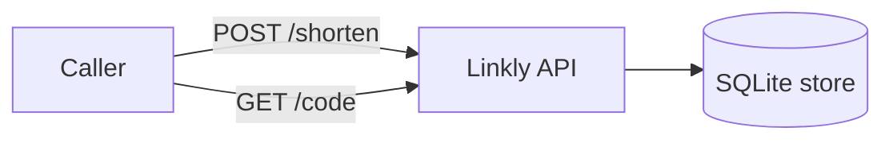

# System context

What talks to what. Consult this when adding an endpoint or an external dependency.

The API is the only component; storage is the single-file SQLite database chosen in
[ADR 0002](/adr/0002-sqlite-store.md).
