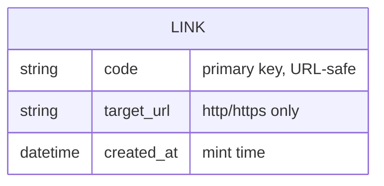

# Data model

The one persisted entity. Mirrors the [constitution](/constitution.md) data model; update
both in the same change if the schema moves.

```mermaid
erDiagram
    LINK {
        string code "primary key, URL-safe"
        string target_url "http/https only"
        datetime created_at "mint time"
    }
```
