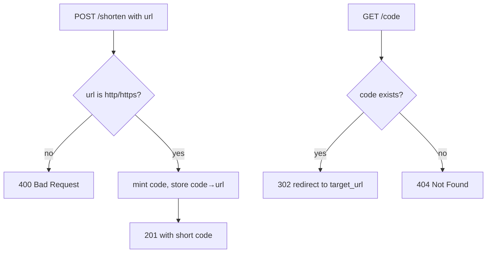

# 0001. Shorten & redirect

## Context

Specifies the observable behavior required by [PRD 0001](/prd/0001-link-shortening.md):
minting a code and resolving it. Written from the outside — what a caller sees, not how
the store works (that is [ADR 0002](/adr/0002-sqlite-store.md)).

## Behavior

## Textual Description

Two observable operations. **Mint:** a caller posts a URL; if it is `http`/`https` the
system returns a freshly minted short code, otherwise it rejects the request with a client
error and stores nothing. **Resolve:** a caller visits `/{code}`; a known code returns a
redirect to its stored `target_url`, an unknown code returns not-found. A minted code
always resolves to the same target for its lifetime.

## Scenarios

Each scenario converts verbatim into the behavioral regression suite. Numbered from 1.

**Scenario 1: mint a valid URL**

- Given an empty store
- When I POST `https://example.com/a/very/long/path` to `/shorten`
- Then I receive `201` with a short code

**Scenario 2: round trip**

- Given a code `abc123` minted for `https://example.com`
- When I GET `/abc123`
- Then I am redirected (`302`) to `https://example.com`

**Scenario 3: unknown code**

- Given an empty store
- When I GET `/nope`
- Then I receive `404` and no redirect

**Scenario 4: reject an unsafe target**

- Given an empty store
- When I POST `javascript:alert(1)` to `/shorten`
- Then I receive `400` and nothing is stored

## Related

- PRD: [/prd/0001-link-shortening.md](/prd/0001-link-shortening.md)
- ADR: [/adr/0002-sqlite-store.md](/adr/0002-sqlite-store.md)
- Issues: [/issues/0001-implement-shorten-endpoint.md](/issues/0001-implement-shorten-endpoint.md)
