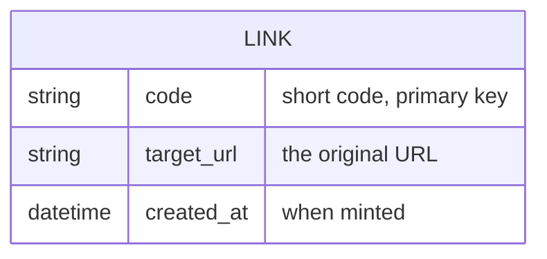

# Linkly Constitution

<!-- Singular file — no NNNN prefix, not listed as a concept in any index.md.
     It is the bundle's root of trace. -->

## Product

Linkly turns a long URL into a short, shareable code and redirects visitors of that code
back to the original. It delivers one thing well: fast, stable links that never change
once minted.

## Scope Boundaries

**In scope:**

- Minting a short code for a valid URL.
- Redirecting a short code to its original URL.

**Explicitly out of scope:**

- Click analytics, dashboards, accounts, and custom vanity domains. Named here so they
  cannot silently creep in during Phase 1.

**Phase boundaries:**

- Phase 1: shorten + redirect, anonymous, single region.
- Phase 2: accounts and click counts (deferred — not designed here).

## Data Model / Schema Foundation

A `LINK` is immutable once minted: a `code` always points at the same `target_url`. This
is the product's core trust commitment and the reason it is fixed in the constitution.

## Non-negotiables

- A minted `code` never changes its `target_url` (links are permanent).
- Only `http`/`https` targets are accepted — never `javascript:` or `data:` (see
  [BDR 0001](/bdr/0001-shorten-and-redirect.md)).
- The doc corpus is authored in **English** (project doc language).
