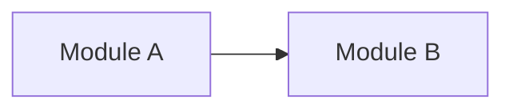

<!-- OKF reserved index.md (§6): a directory listing — NO frontmatter. The view files
     it links ARE concepts and each carries `type: Architecture View` frontmatter. -->

# Architecture

Living architecture of the project: how the components fit together, expressed as
Mermaid diagrams that must always match the code. This index is the entry point; each
view file owns one diagram/concern. Update the relevant view in the same change as any
structural code change (see the maintenance rule in the project guide).

## Views

| File | View | Mermaid type |
|---|---|---|
| [context.md](context.md)         | High-level components & external world | `flowchart` |
| [data-model.md](data-model.md)   | Entities & relationships               | `erDiagram` |
| [modules.md](modules.md)         | Module layout & dependencies           | `flowchart` |
| [<flow>.md](flow.md)             | <Key process / data flow>              | `flowchart` |
| [<request>.md](request.md)       | <Tool-calling / request round trip>    | `sequenceDiagram` |

<!-- Add a row whenever a new view file is created. -->

## Example view file skeleton

A view file is an OKF concept: it opens with frontmatter, then an H1 title, one sentence
of orientation, then the Mermaid block:

````markdown
---
type: Architecture View
title: <View name>
description: <One sentence — what this view shows.>
timestamp: <ISO 8601 datetime>
---

# <View name>

<One sentence: what this view shows and when to consult it.>


````
