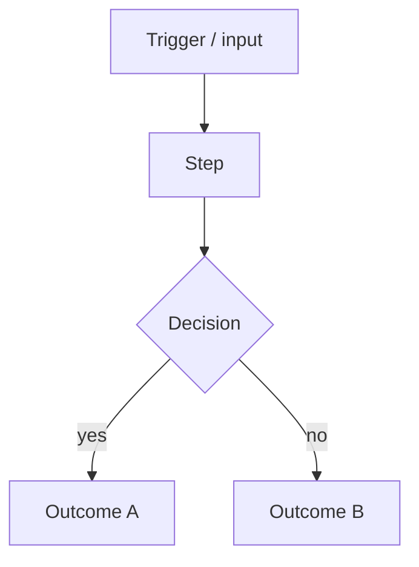

# NNNN. <Short behavior title>

<!-- Status lives in frontmatter (`status`), not a body line. -->

## Context

<What observable behavior is being specified? What user need or system requirement
demands it? Link the PRD or ADR that spawned this BDR, and any issue that tracks the
work, bundle-relative: [PRD](/prd/NNNN-<slug>.md), [ADR](/adr/NNNN-<slug>.md).>

## Behavior

<Replace the diagram above with a flowchart or sequence diagram that shows the full
observable flow. Use Mermaid only — no images, no ASCII art.>

## Textual Description

<Prose form of the behavior. Describe what the system does from the outside: inputs,
outputs, side effects, error paths. Write as if the code does not exist yet — what an
observer would verify by watching the running system.>

## Scenarios

Each scenario is written to convert verbatim into the project's behavioral regression
suite. Number from 1; do not skip numbers.

**Scenario 1: <happy-path name>**

- Given <initial state or precondition>
- When <the trigger or action>
- Then <the observable outcome>

**Scenario 2: <edge or error case>**

- Given <initial state or precondition>
- When <the trigger or action>
- Then <the observable outcome>

## Related

- PRD: [/prd/NNNN-<slug>.md](/prd/NNNN-<slug>.md)
- ADR: [/adr/NNNN-<slug>.md](/adr/NNNN-<slug>.md)
- Issues: [/issues/NNNN-<slug>.md](/issues/NNNN-<slug>.md)
