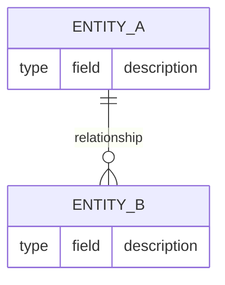

# Product Constitution

<!-- Status lives in frontmatter (`status`). This file is singular — no NNNN prefix,
     and it is NOT listed as a concept in any index.md. It is the bundle's root of trace. -->

## Product

<What the product is, in one or two sentences. State the core value it delivers and
who it delivers it to. This is the north star — every PRD and ADR must be consistent
with it.>

## Scope Boundaries

**In scope:**

- <Capability or domain the product owns.>

**Explicitly out of scope:**

- <Tempting-but-excluded capability. Name it so it cannot silently creep in.>

**Phase boundaries:**

- Phase 1: <what is in scope for the current phase and what defers>
- Phase 2: <…>

## Data Model / Schema Foundation

<The core entities and their relationships. This section fixes what the rest of the
system is built on. Represent structure as a Mermaid entity-relationship or class
diagram. Describe cardinalities and invariants in prose below the diagram.>

## Non-negotiables

<Constraints that hold regardless of feature set, phase, or implementation choice.
Examples: compliance requirements, security invariants, performance floors, user-trust
commitments. Each item should be falsifiable — someone could check the running system
and say "violated" or "holds".>

- <Non-negotiable 1>

## Amendment Log

<!-- Append amendments here; do not edit sections above once ratified.            -->
<!-- Format: ## Amendment N — YYYY-MM-DD: 
        -->
<!-- A directory-level log.md (OKF §7) MAY also record amendment history.          -->
