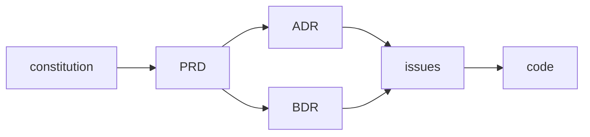

# Living Docs

Treat documentation as a living system that stays in sync with the code, not a write-once artifact that rots. The discipline has one spine — **every piece of knowledge has exactly one home, that home is indexed, and nothing structural ships without its doc** — and several document types that hang off it: a constitution, ADRs, BDRs, PRDs, issues, research, architecture diagrams, and a semantic context index.

This skill is stack-agnostic. It governs *how* docs are organized and maintained, never *what* technology a project uses.

---

## Core invariants (the spine)

These hold across every document type. Everything else is detail.

1. **Docs-first.** Author the body in the repo (`docs/…`) *before* publishing anywhere external (tracker, wiki). The repo file is the source of truth; the external copy is a mirror.
2. **One home per fact.** Each concept, decision, or requirement lives in exactly one file. No duplication — cross-reference instead of copying. Duplicated prose is drift waiting to happen.
3. **Indexed or it doesn't exist.** Every doc is reachable from an index (an `index.md` listing in its directory, and the bundle-root `docs/index.md` that the project guide links). No orphan files.
4. **Supersede, never rewrite history.** Decisions and requirements are append-only records. When something changes, mark the old record superseded and write a new one — never silently edit the past.
5. **No structural change without its doc.** New module, moved files, schema change, new data flow → update the relevant doc *and its diagram* in the same change. No "I'll document it later."

When in doubt, re-derive the right action from these five. The rules files below are just these invariants applied to each document type.

---

## Format: OKF-conformant

The five invariants govern *organization and lifecycle*; the **Open Knowledge Format** governs the *file format* so the corpus stays portable and agent-parseable. Every doc in the system is also an OKF concept. Load the `okf-knowledge-format` skill (it vendors the spec) when authoring or checking format. Two rules apply to every concept file:

1. **Frontmatter with a required `type`.** Every non-reserved `.md` doc opens with a YAML frontmatter block whose `type` names the doc kind (`Constitution`, `PRD`, `ADR`, `BDR`, `Issue`, `Context`, `Architecture View`, `Research`, `Reference`). Recommended: `title`, `description`, `tags`, `timestamp`. Living-docs adds producer keys: `status`, `supersedes`, `superseded_by`. **Status moves into frontmatter — no `**Status:**` body line.**
2. **Reserved files + bundle-relative links.** The bundle root is `docs/`. Directory listings are `index.md` (OKF §6, no frontmatter — except the bundle-root `docs/index.md`, which carries `okf_version: "0.1"`). Optional `log.md` records directory history (§7). Cross-link with `/`-prefixed bundle-relative paths (`/adr/0007-slug.md`); list sources under a `# References` heading (§8), each entry formatted per `rules/citation-conventions.md` — **ABNT NBR 6023 structure, always carrying the link**, with connective labels in the project doc language (default English: `Available at: <URL>. Accessed on: <date>`) per `rules/doc-language.md`.

---

## Doc trail

Every change follows this chain, from foundational source of truth down to code:

| Artifact | Role |
|---|---|
| **constitution** | Foundational source of truth: what the product is, core data model, non-negotiables. All other docs sit under it. |
| **PRD** | What the system must do and why — feature/product requirement spec. |
| **ADR** | How the system is structured — architectural/implementation decision and rationale. |
| **BDR** | What the system must observably do — inputs, outputs, side effects, Given/When/Then scenarios. |
| **issues** | Execution slices — discrete units of work that trace back to ADRs/BDRs. |
| **code** | Implementation — every behavior, structure, and interface specified above, realized. |

---

## When to invoke

- Standing up documentation for a project (creating `docs/` structure, the docs index, ADR/issue/BDR/constitution directories).
- Writing or editing an **ADR** (an architectural/implementation decision) → load `rules/adr-conventions.md` + `templates/adr.md`.
- Writing or editing a **PRD** (a product/feature requirement spec) → load `rules/prd-conventions.md` + `templates/prd.md`.
- Writing or editing a **BDR** (observable behavior — inputs, outputs, Given/When/Then scenarios) → load `rules/bdr-conventions.md` + `templates/bdr.md`.
- Establishing or amending the **constitution** (foundational scope, data model, non-negotiables) → load `rules/constitution-conventions.md` + `templates/constitution.md`.
- Creating or editing an **issue/ticket** → load `rules/issue-workflow.md` + `templates/issue.md`.
- Recording **research** (technology evaluation, external trade-offs) → load the **`research-artifacts`** skill. It owns the OKF research-note format (single file per note, no per-research subfolder), the source discipline, and the research → decision → issue traceable chain, and links back here for the ADR/BDR/issue artifacts. Pairs with the `deep-research` skill.
- Drawing or updating an **architecture, data-flow, or tool-calling diagram** → load `rules/architecture-diagrams.md` + `templates/architecture-index.md`.
- Defining a **term or acronym** the docs use → add it to the **glossary** (`docs/context/glossary.md`), one home per term → load `rules/glossary-conventions.md` + `templates/glossary.md`.
- A doc has grown too large or mixes concerns → **split into a semantic index** → load `rules/semantic-index.md` + `templates/context-index.md`.
- Enforcing the **no-drift maintenance rule** after any structural change → load `rules/maintenance-invariant.md`.
- Authoring or checking the **OKF format** of any doc (frontmatter `type`, reserved `index.md`/`log.md`, bundle-relative links, `# References`) → load the **`okf-knowledge-format`** skill.
- Deciding **which language** the docs are written in (default English; user may override at session start and pin it) → load `rules/doc-language.md`.

---

## Document map

| Type | Lives in | Purpose | Mutability |
|---|---|---|---|
| Project guide | `CLAUDE.md` / `README.md` (root) | Entry point: scope, stack, docs index, mandatory workflows | Live — edit freely |
| Constitution | `docs/constitution.md` | Foundational source of truth: product scope, data model, non-negotiables | Append-only once ratified (amendment log) |
| Context index | `docs/context/index.md` + group files | Domain & module vocabulary, semantically grouped | Live — edit freely |
| Glossary | `docs/context/glossary.md` | Terms & acronyms defined once, in the doc language (acronym headwords as-is) | Live — edit freely |
| Architecture | `docs/architecture.md` or `docs/architecture/` + index | Living Mermaid diagrams: structure, data model, flows, tool-calling | Live — must match code |
| ADR | `docs/adr/NNNN-slug.md` | One architectural/implementation decision | Append-only (supersede) |
| BDR | `docs/bdr/NNNN-slug.md` | One observable-behavior decision | Append-only (supersede or amend) |
| PRD | `docs/prd/NNNN-slug.md` | One feature/product requirement spec | Append-only once accepted |
| Issue | `docs/issues/NNNN-slug.md` | Tracker mirror (body), one per ticket | Body editable; published copy follows |
| Research | `docs/research/NNNN-<slug>.md` (single file, no subfolder; sequential number leads, date in frontmatter `timestamp`; ends in `# References`) | External evidence with sourced claims | Append-only (evidence is dated) |

Each directory carries its own `index.md` listing (OKF §6, no frontmatter). The project guide's "Docs index" links to the bundle-root `docs/index.md`. See `rules/semantic-index.md` for the indexing contract.

---

## Procedure

### Setting up living docs in a new project

1. Create the project guide (`CLAUDE.md` or equivalent) with a **Docs index** section and a **Maintenance rule** section (copy the wording from `rules/maintenance-invariant.md`). Use `templates/claude-hard-rules.md` as the starting point for the project guide's hard-rules section — fill in the placeholders before committing.
2. Create `docs/` with the directories the project needs (`adr/`, `bdr/`, `issues/`, `prd/`, `research/`, `context/`). Seed `docs/constitution.md` from `templates/constitution.md`. Add the bundle-root `docs/index.md` (carrying `okf_version: "0.1"`), and give each directory its own `index.md` listing from day one — even if near-empty.
3. Seed the context index (`docs/context/index.md`) with whatever domain vocabulary exists, and the glossary (`docs/context/glossary.md`) with the terms and acronyms the docs already assume (`rules/glossary-conventions.md`). Grow both as concepts are named.
4. Seed the architecture doc (`docs/architecture.md`) with the high-level Mermaid views the system already has. Promote to a `docs/architecture/` directory + index once it grows (`rules/architecture-diagrams.md`).
5. Record any already-made decisions as ADRs so they are not re-litigated.

### Maintaining living docs (every task)

1. **Before coding:** read the relevant constitution, ADRs, BDRs, and the context index. Decisions there are not to be re-opened casually.
2. **While working:** if you name a new concept, add it to the context index; if you introduce a new term or acronym, define it once in the glossary. If you make a decision with a load-bearing rationale, write an ADR. If you specify observable behavior, write or amend a BDR.
3. **In the same change:** update every doc the structural change touches — index rows, **architecture diagrams**, vocabulary. Run the maintenance checklist (`rules/maintenance-invariant.md`).
4. **Never** leave an index stale, an orphan file unlinked, a diagram contradicting the code, or a superseded decision silently edited.

---

## Composition with other skills

- **`grill-me`** — before writing a PRD or a load-bearing ADR, grill the design to surface the real decision and its alternatives. The grilling output becomes the ADR's Context/Consequences.
- **`improve-codebase-architecture`** — reads the context index and ADRs to find deepening opportunities; emits new ADRs when a candidate is rejected for a load-bearing reason. This skill provides the ADR/context/architecture formats that one consumes.
- **`research-artifacts`** — owns the research-note format and discipline (a single-file OKF `docs/research/NNNN-<slug>.md` — sequential number leads, date in frontmatter — with a trailing `# References`, plus the cross-research `docs/research/references.md` roll-up, source rules, the research → decision → issue chain). Living-docs delegates all research authoring to it and consumes its output: an accepted recommendation becomes an ADR/BDR here, which spawns issues. The links between the two are bidirectional.
- **`deep-research`** — gathers and cross-verifies the evidence that lands in `docs/research/`; the `research-artifacts` skill defines how that evidence is formatted, indexed, and referenced from ADRs/PRDs.
- **`init-codegraph`** — the structural index of *code*; the context index is the human-readable index of *concepts* and the architecture diagrams are the visual index of *structure*. Keep all current.
- **`wave-execution`** — executes the issues these docs plan, one PR per wave. Wave execution is the implementation phase that consumes the ADRs, BDRs, and issues produced here.
- **`implementation-review`** — verifies the implementation before it ships. Review checks that the code honors the ADRs and BDRs, and that every specified observable behavior (Given/When/Then) is tested.
- **`okf-knowledge-format`** — the portable, exchange-oriented **format** standard (Open Knowledge Format: markdown + YAML frontmatter, required `type`, reserved `index.md`/`log.md`, bundle-relative links, conformance rules). Living-docs governs *which* docs exist and the no-drift discipline; OKF governs *how* a knowledge bundle's markdown and frontmatter are shaped. Author a shareable knowledge corpus — e.g. `docs/context/` vocabulary or a `docs/research/` catalog meant to be consumed by agents or exchanged across orgs — as an OKF bundle so its frontmatter and indexing are spec-conformant. The two compose; they do not overlap.

---

## Quality checks

Before considering a docs change complete:

- [ ] Every concept doc opens with OKF frontmatter carrying a non-empty `type`; `status` is in frontmatter, not a body line.
- [ ] Directory listings are `index.md` with no frontmatter (except the bundle-root `docs/index.md` → `okf_version`); cross-links are bundle-relative (`/…`).
- [ ] Every new doc is linked from its directory `index.md` **and** the bundle-root `docs/index.md`.
- [ ] No concept appears in two files (cross-reference instead).
- [ ] Every acronym the docs use has a glossary entry with its expansion **and** a definition in the doc language; the headword is the acronym as-is. Term names, identifiers, and acronym headwords/expansions stay in their original form — only the explanation is in the doc language.
- [ ] Each term is defined once (in the glossary); other docs link to it rather than redefine.
- [ ] Superseded ADRs/PRDs/BDRs carry frontmatter `status: Superseded` + `superseded_by: NNNN`; the superseding record sets `supersedes` and links back.
- [ ] Any structural code change in the same task updated its doc **and its Mermaid diagram(s)**.
- [ ] Architecture diagrams use Mermaid (in-repo text), match the code, and use context-index vocabulary for node/participant names.
- [ ] Every BDR has a Mermaid diagram, a textual description, and numbered Given/When/Then scenarios.
- [ ] The constitution is singular (`docs/constitution.md`) — no NNNN prefix, no index entry.
- [ ] Each index file's links all resolve (no dangling references).
- [ ] Docs-first respected: the repo body matches the published tracker/wiki copy.

---

## Notes

- Keep individual docs scannable. When a context, vocabulary, or architecture file passes ~200 lines or mixes concerns, split it via `rules/semantic-index.md` rather than letting it grow.
- This skill describes conventions, not tooling. Numbering schemes (`NNNN`), tracker choice (GitHub Issues, Jira), and directory names can be adapted per project — the invariants must not.
- Templates in `templates/` are starting points. Trim sections that don't apply; never delete a section just to avoid filling it in if it's load-bearing.

---

## Provenance — instrumentalization, not invention

Almost every doc type here is established prior art; this skill composes and enforces them, it does not invent them:

- **"Living documentation"** is **Cyrille Martraire's** named methodology (*Living Documentation*, 2019) — we adopted the term.
- **ADR** is **Michael Nygard's** (2011); the structured-markdown form is **MADR**; the *supersede-don't-delete* status convention is the **adr-tools** convention (**Nat Pryce**) — invariant 4 is that convention, not a new rule.
- **BDR** is **Specification by Example / Given-When-Then** (**Adzic** 2011; **North** 2006) in an ADR-style record (recent third-party coinage, **Zanzal** 2026) — see `rules/bdr-conventions.md`.
- The **problem-first PRD** and **vertical-slice issue** workflow are a kindred influence from **Matt Pocock's** `to-prd` / `to-issues` skills (github.com/mattpocock/skills, MIT); both instrumentalize older practice — product PRDs, user stories (**Cohn**; **Beck**), tracer-bullet vertical slices (**Hunt & Thomas**; **Cockburn**), and "make the change easy, then make the easy change" (**Beck**). Living-docs adds the OKF format, the docs-first mirror, and supersede governance.
- The **format** is **OKF**, a published **Google Cloud Platform** standard (v0.1, 2026-06-12), not ours — see the `okf-knowledge-format` skill.
- Neighbors we converge on: **Diátaxis** (Procida), **arc42** (Starke; Hruschka), **C4** (Brown), and **docs-as-code** (Write the Docs).

The genuinely unusual part is the **composition + the governance invariants** (supersede-never-delete + one-home-per-fact + indexed-or-doesn't-exist carried in frontmatter as a fact contract), for which the prior-art research found no prior assembly — not the trail or any individual doc type. Full citations: `../../references/prior-art-landscape.md`.
