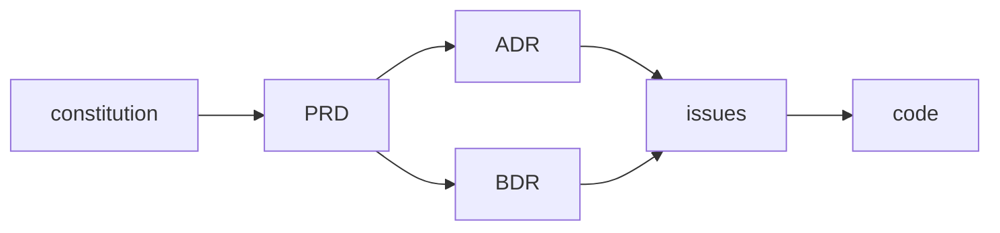

# Living Docs

Treat documentation as a living system that stays in sync with the code, not a write-once artifact that rots. The discipline has one spine — **every piece of knowledge has exactly one home, that home is indexed, and nothing structural ships without its doc** — and several document types that hang off it: a constitution, ADRs, BDRs, PRDs, issues, research, architecture diagrams, and a semantic context index.

This skill is stack-agnostic. It governs *how* docs are organized and maintained, never *what* technology a project uses.

---

## Core invariants (the spine)

These hold across every document type. Everything else is detail.

1. **Docs-first.** Author the body in the repo (`docs/…`) *before* publishing anywhere external (tracker, wiki). The repo file is the source of truth; the external copy is a mirror.
2. **One home per fact.** Each concept, decision, or requirement lives in exactly one file. No duplication — cross-reference instead of copying. Duplicated prose is drift waiting to happen.
3. **Indexed or it doesn't exist.** Every doc is reachable from an index (an `index.md` listing in its directory, and the bundle-root `docs/index.md` that the project guide links). No orphan files.
4. **Supersede, never rewrite history.** Decisions and requirements are append-only records. When something changes, mark the old record superseded and write a new one — never silently edit the past.
5. **No structural change without its doc.** New module, moved files, schema change, new data flow → update the relevant doc *and its diagram* in the same change. No "I'll document it later."

When in doubt, re-derive the right action from these five. The rules files below are just these invariants applied to each document type.

---

## Format: OKF-conformant

The five invariants govern *organization and lifecycle*; the **Open Knowledge Format** governs the *file format* so the corpus stays portable and agent-parseable. Every doc in the system is also an OKF concept. Load the `okf-knowledge-format` skill (it vendors the spec) when authoring or checking format.

> **OKF is a thin, swappable dependency — not a foundation (version risk).** OKF is **v0.1
> from a single vendor**; a backward-incompatible v0.2 is a real possibility. The invariants
> above do **not** depend on OKF — they depend only on a small set of frontmatter fields, so an
> OKF break cannot take the governance layer down with it. Keep the boundary explicit:
> - **Required by Living Docs** (the fact contract `living-docs check` enforces): a non-empty
>   `type`, and `status` + `superseded_by` on superseded records. These are *ours*; they survive
>   regardless of OKF.
> - **Inherited from OKF** (format conventions): reserved `index.md`/`log.md`, the bundle-root
>   `okf_version`, bundle-relative links, the `# References` heading (§8). If OKF changes, only
>   this row moves — re-pin the version in the `okf-knowledge-format` skill and adjust.

Two rules apply to every concept file:

1. **Frontmatter with a required `type`.** Every non-reserved `.md` doc opens with a YAML frontmatter block whose `type` names the doc kind (`Constitution`, `PRD`, `ADR`, `BDR`, `Issue`, `Context`, `Architecture View`, `Research`, `Reference`). Recommended: `title`, `description`, `tags`, `timestamp`. Living-docs adds producer keys: `status`, `supersedes`, `superseded_by`. **Status moves into frontmatter — no `**Status:**` body line.**
2. **Reserved files + bundle-relative links.** The bundle root is `docs/`. Directory listings are `index.md` (OKF §6, no frontmatter — except the bundle-root `docs/index.md`, which carries `okf_version: "0.1"`). Optional `log.md` records directory history (§7). Cross-link with `/`-prefixed bundle-relative paths (`/adr/0007-slug.md`); list sources under a `# References` heading (§8), each entry formatted per `rules/citation-conventions.md` — **ABNT NBR 6023 structure, always carrying the link**, with connective labels in the project doc language (default English: `Available at: <URL>. Accessed on: <date>`) per `rules/doc-language.md`.

---

## Doc trail

Every change follows this chain, from foundational source of truth down to code:



| Artifact | Role |
|---|---|
| **constitution** | Foundational source of truth: what the product is, core data model, non-negotiables. All other docs sit under it. |
| **PRD** | What the system must do and why — feature/product requirement spec. |
| **ADR** | How the system is structured — architectural/implementation decision and rationale. |
| **BDR** | What the system must observably do — inputs, outputs, side effects, Given/When/Then scenarios — **and how each is tested** (the Test Design matrix; single home for "how to test", an execution issue links it). |
| **issues** | Execution slices — discrete units of work that trace back to ADRs/BDRs. |
| **code** | Implementation — every behavior, structure, and interface specified above, realized. |

---

## When to invoke

- Standing up documentation for a project (creating `docs/` structure, the docs index, ADR/issue/BDR/constitution directories).
- **First time living-docs runs in a project** (no `## Living Docs` block in the project guide) → ask the enforcement-mode question and persist the answer → see **Enforcement modes**.
- **Adopting living-docs in an existing/brownfield project** (decisions already made but undocumented) → follow *Procedure → Adopting living docs in an existing project*: inventory the decisions, **confirm each with the user before recording any ADR**, never back-fill by inference alone.
- Writing or editing an **ADR** (an architectural/implementation decision) → load `rules/adr-conventions.md` + `templates/adr.md`.
- Writing or editing a **PRD** (a product/feature requirement spec) → load `rules/prd-conventions.md` + `templates/prd.md`.
- Writing or editing a **BDR** (observable behavior — inputs, outputs, Given/When/Then scenarios, **and the Test Design matrix for how each is tested**) → load `rules/bdr-conventions.md` + `templates/bdr.md`. A test-strategy *decision* (non-default level/technique, bar deviation) is an ADR `tags: [testing]`, not a new record type (no "TDR").
- Specifying a **non-functional requirement** (performance, availability, security, scale) → a **quality-attribute scenario** bound to an instrument in the **PRD** (`rules/prd-conventions.md` rule 9 + `templates/prd.md`); the decision + fitness function go in an ADR. Not a new doc type.
- Establishing or amending the **constitution** (foundational scope, data model, non-negotiables) → load `rules/constitution-conventions.md` + `templates/constitution.md`.
- Creating or editing an **issue/ticket** → load `rules/issue-workflow.md` + `templates/issue.md`.
- Recording **research** (technology evaluation, external trade-offs) → load the **`research-artifacts`** skill. It owns the OKF research-note format (single file per note, no per-research subfolder), the source discipline, and the research → decision → issue traceable chain, and links back here for the ADR/BDR/issue artifacts. Pairs with the `deep-research` skill.
- Drawing or updating an **architecture, data-flow, or tool-calling diagram** → load `rules/architecture-diagrams.md` + `templates/architecture-index.md`.
- Defining a **term or acronym** the docs use → add it to the **glossary** (`docs/context/glossary.md`), one home per term → load `rules/glossary-conventions.md` + `templates/glossary.md`.
- A doc has grown too large or mixes concerns → **split into a semantic index** → load `rules/semantic-index.md` + `templates/context-index.md`.
- Enforcing the **no-drift maintenance rule** after any structural change → load `rules/maintenance-invariant.md`.
- Authoring or checking the **OKF format** of any doc (frontmatter `type`, reserved `index.md`/`log.md`, bundle-relative links, `# References`) → load the **`okf-knowledge-format`** skill.
- Deciding **which language** the docs are written in (default English; user may override at session start and pin it) → load `rules/doc-language.md`.

---

## Document map

| Type | Lives in | Purpose | Mutability |
|---|---|---|---|
| Project guide | `CLAUDE.md` / `README.md` (root) | Entry point: scope, stack, docs index, mandatory workflows | Live — edit freely |
| Constitution | `docs/constitution.md` | Foundational source of truth: product scope, data model, non-negotiables | Append-only once ratified (amendment log) |
| Context index | `docs/context/index.md` + group files | Domain & module vocabulary, semantically grouped | Live — edit freely |
| Glossary | `docs/context/glossary.md` | Terms & acronyms defined once, in the doc language (acronym headwords as-is) | Live — edit freely |
| Architecture | `docs/architecture.md` or `docs/architecture/` + index | Living Mermaid diagrams: structure, data model, flows, tool-calling | Live — must match code |
| ADR | `docs/adr/NNNN-slug.md` | One architectural/implementation decision | Append-only (supersede) |
| BDR | `docs/bdr/NNNN-slug.md` | One observable-behavior decision | Append-only (supersede or amend) |
| PRD | `docs/prd/NNNN-slug.md` | One feature/product requirement spec | Append-only once accepted |
| Issue | `docs/issues/NNNN-slug.md` | Tracker mirror (body), one per ticket | Body editable; published copy follows |
| Research | `docs/research/NNNN-<slug>.md` (single file, no subfolder; sequential number leads, date in frontmatter `timestamp`; ends in `# References`) | External evidence with sourced claims | Append-only (evidence is dated) |

Each directory carries its own `index.md` listing (OKF §6, no frontmatter). The project guide's "Docs index" links to the bundle-root `docs/index.md`. See `rules/semantic-index.md` for the indexing contract.

---

## Procedure

### Setting up living docs in a new project

1. **Ask the enforcement-mode question** (see *Enforcement modes* → *First-run question*) before anything else, since no preference is persisted yet. Record the answer as the `## Living Docs` block in the project guide; default to `strict` if the user has no preference.
2. Create the project guide (`CLAUDE.md` or equivalent) with a **Docs index** section and a **Maintenance rule** section (copy the wording from `rules/maintenance-invariant.md`). Use `templates/claude-hard-rules.md` as the starting point for the project guide's hard-rules section — it already carries the `## Living Docs` enforcement block; fill in the placeholders before committing.
3. Create `docs/` with the directories the project needs (`adr/`, `bdr/`, `issues/`, `prd/`, `research/`, `context/`). Seed `docs/constitution.md` from `templates/constitution.md`. Add the bundle-root `docs/index.md` (carrying `okf_version: "0.1"`), and give each directory its own `index.md` listing from day one — even if near-empty.
4. Seed the context index (`docs/context/index.md`) with whatever domain vocabulary exists, and the glossary (`docs/context/glossary.md`) with the terms and acronyms the docs already assume (`rules/glossary-conventions.md`). Grow both as concepts are named.
5. Seed the architecture doc (`docs/architecture.md`) with the high-level Mermaid views the system already has. Promote to a `docs/architecture/` directory + index once it grows (`rules/architecture-diagrams.md`).
6. Record any already-made decisions as ADRs so they are not re-litigated — but **confirm each with the user before recording** (see *Adopting living docs in an existing project*, steps 3–5); never back-fill an ADR by inference alone.

### Adopting living docs in an existing project (brownfield)

An existing codebase already embodies decisions that were never written down. The failure mode here is the agent **back-filling ADRs by inference and presenting them as settled** — recording decisions the user was never asked to confirm. Adoption is therefore an *elicitation* exercise, not a transcription one.

1. **Ask the enforcement-mode question** (first-run) and persist the `## Living Docs` block, exactly as for a new project.
2. **Scaffold without deciding.** Create `docs/` + each directory's `index.md`, the bundle-root `docs/index.md`, and seed the glossary/context index from vocabulary already present in the **code, the `README`, and the agent guides (`CLAUDE.md` / `AGENTS.md`)**. This is mechanical — no decisions are made here.
3. **Read the existing context first, then inventory the decisions — as candidates, not records.** Harvest what the project already carries: the code itself, plus the `README`, the agent guides (`CLAUDE.md` / `AGENTS.md`), package manifests, and any design notes or comments. From that, produce a *list* of the load-bearing decisions the project appears to embody (stack, boundaries, data model, key trade-offs). Do **not** write ADRs yet.
4. **Present the inventory to the user and confirm each.** For every candidate, state the inferred decision and the alternatives it appears to have ruled out, and ask the user to confirm, correct, or discard it — grill the load-bearing ones (`grill-me` if installed). The user owns the decision; the agent only surfaces what the code implies.
5. **Record only the confirmed decisions as ADRs.** These are origin records — they supersede nothing. Capture the chosen option *and* the rejected alternatives the user confirmed. A candidate the user discards, or one whose rationale nobody actually knows, is **not** invented into an ADR.
6. **Seed the architecture doc** with the high-level Mermaid views the system already has (`rules/architecture-diagrams.md`), then resume the *Maintaining* loop below.

### Maintaining living docs (every task)

1. **Before coding:** read the `## Living Docs` enforcement mode from the project guide (if the block is absent, this is the first run — ask the first-run question and persist the answer). Then read the relevant constitution, ADRs, BDRs, and the context index. Decisions there are not to be re-opened casually.
2. **While working:** if you name a new concept, add it to the context index; if you introduce a new term or acronym, define it once in the glossary. If you make a decision with a load-bearing rationale, **grill it before recording it** — surface the decision, ≥2 materially-distinct alternatives, and a recommendation to the user (run the `grill-me` companion if installed, else inline), then write an ADR capturing the chosen option *and* the rejected ones. If you specify observable behavior, write or amend a BDR. Never record a decision the user was not asked about (see *Enforcement modes → Mode governs completion, not elicitation*).
3. **In the same change:** update every doc the structural change touches — index rows, **architecture diagrams**, vocabulary. Run the maintenance checklist (`rules/maintenance-invariant.md`).
4. **Never** leave an index stale, an orphan file unlinked, a diagram contradicting the code, or a superseded decision silently edited.

---

## Composition with other skills

**Bundled in this repo** — installed alongside living-docs:

- **`okf-knowledge-format`** — the portable, exchange-oriented **format** standard (Open Knowledge Format: markdown + YAML frontmatter, required `type`, reserved `index.md`/`log.md`, bundle-relative links, conformance rules). Living-docs governs *which* docs exist and the no-drift discipline; OKF governs *how* a knowledge bundle's markdown and frontmatter are shaped. Author a shareable knowledge corpus — e.g. `docs/context/` vocabulary or a `docs/research/` catalog meant to be consumed by agents or exchanged across orgs — as an OKF bundle so its frontmatter and indexing are spec-conformant. The two compose; they do not overlap.
- **`research-artifacts`** — owns the research-note format and discipline (a single-file OKF `docs/research/NNNN-<slug>.md` — sequential number leads, date in frontmatter — with a trailing `# References`, plus the cross-research `docs/research/references.md` roll-up, source rules, the research → decision → issue chain). Living-docs delegates all research authoring to it and consumes its output: an accepted recommendation becomes an ADR/BDR here, which spawns issues. The links between the two are bidirectional.

**Optional companions** — these are *not* included in this repo; living-docs works without them, and only composes with them if you happen to have them installed:

- **`grill-me`** ([Matt Pocock's skills](https://github.com/mattpocock/skills), MIT — `make install-pocock`) — before writing a PRD or a load-bearing ADR, grill the design to surface the real decision and its alternatives. The grilling output becomes the ADR's Context/Consequences. The *Maintaining* loop (step 2) and the brownfield-adoption procedure invoke this step explicitly; without `grill-me` installed, do the lightweight inline version — state the decision, ≥2 materially-distinct alternatives, and a recommendation, and get the user's call before recording.
- A **research-gathering** skill (e.g. a deep-research tool) gathers and cross-verifies the evidence that lands in `docs/research/`; `research-artifacts` defines how that evidence is formatted, indexed, and referenced from ADRs/PRDs.
- A **code-structure index** (e.g. a codegraph tool) is the structural index of *code*; living-docs' context index is the human-readable index of *concepts* and the architecture diagrams are the visual index of *structure*. Keep all current.
- An **execution/review** step downstream consumes what these docs plan: it implements the issues and verifies that the code honors the ADRs and BDRs, and that every specified observable behavior (Given/When/Then) is tested.

---

## Enforcement modes

The five invariants above are **always** hard stops — they hold in every project regardless of mode (an orphan file or a silent rewrite is never acceptable). What the *mode* governs is the **doc trail** (constitution → PRD → ADR/BDR → issues → code): how strictly the agent refuses a structural or behavioral change that ships without its decision record.

The mode is chosen **once, by the user, the first time living-docs runs in the project**, and persisted in the project guide. The default is `strict` — the discipline is **opt-out, not opt-in**, because a flow nobody is forced to follow is the flow that rots first.

| Mode | Doc trail | Agent behavior |
|---|---|---|
| `strict` (default) | Mandatory | Refuses to report a structural/behavioral task complete without its required doc (PRD/ADR/BDR/issue). Same hard-stop weight as the five invariants. |
| `guided` | Prompted | Pauses and asks the user before skipping a doc-trail step. The user may waive a step per task; the waiver is not remembered. |
| `lite` | Advisory | Only the five invariants are hard stops. The doc trail is recommended, never enforced (this is the pre-0.3 behavior). |

### Mode governs completion, not elicitation

A frequent misread is that `strict` means "the agent interrogates every decision." It does not. The mode governs **completion enforcement** — whether a structural/behavioral task may be reported done without its doc. It says nothing about *how the decision inside that doc was reached*.

**Decision elicitation (grilling) is a separate, always-on concern**, independent of mode. A load-bearing decision is never recorded from the agent's own inference alone: before writing an ADR/BDR, surface the decision, **≥2 materially-distinct alternatives**, and a recommendation to the user, then record the chosen option **and the rejected ones**. Run the `grill-me` companion (see *Composition*) to drive that interrogation if it is installed; otherwise do the lightweight inline version. **Never write an ADR for a decision the user was never asked about** — in any mode. Mode changes whether you may *ship* without the doc; it never licenses inventing the decision the doc records.

### First-run question

When living-docs is invoked in a project and **no enforcement preference is yet persisted** (no `## Living Docs` block in the project guide), ask the user once, *before* doing the work:

> This project hasn't set a living-docs enforcement mode yet. How strictly should the doc trail (PRD → ADR/BDR → issues) be enforced?
> - **strict** (recommended) — every structural/behavioral change must carry its doc; I'll refuse to call a task done without it.
> - **guided** — I'll ask before skipping a doc-trail step.
> - **lite** — only the five invariants are enforced; the doc trail is advice.

Persist the answer immediately in the project guide (`CLAUDE.md`, where it enters context at session start), then proceed:

```
## Living Docs
enforcement: strict   # strict | guided | lite
onboarded: <YYYY-MM-DD>
```

**Absence of the block is the only first-run signal**; presence of any valid `enforcement` value means onboarded — never ask again, just read it and apply it. To change modes later, the user edits the block.

Doc-trail enforcement is a **judgement** call (there is no sound oracle for "did this change need an ADR"), so it lives with the agent, not with `living-docs check`. The mechanical invariants (frontmatter, indexing, links, supersede) are checked the same way in every mode.

## Agent enforcement (refusal triggers)

The value of this skill is not the discipline — humans abandon "nothing structural without
its doc" at the first deadline. The value is an **agent that enforces it automatically**. So
the invariants are not advice; they are **hard stops**. When acting as the agent, do **not**
report a docs-touching task as complete if any of these hold — fix it or surface it first:

1. **Orphan.** A new or moved concept file is not listed in its directory `index.md` (and that
   directory is not reachable from the bundle-root `docs/index.md`). *Indexed or it doesn't exist.*
2. **Stale diagram.** A structural change (schema, module layout, data flow, new component)
   landed without updating its Mermaid diagram in the **same** change.
3. **Silent rewrite.** A decision/requirement was edited in place instead of superseded — or a
   record is `status: Superseded` with no `superseded_by`.
4. **Untyped doc.** A non-reserved `.md` is missing frontmatter or a non-empty `type`; or an
   `index.md`/`log.md` carries frontmatter (except the bundle-root `index.md`).
5. **Broken link.** A bundle-relative (`/…`) or relative link points at a file that does not exist.
6. **Duplicate home.** The same fact now lives in two files (cross-reference instead).
7. **Broken doc trail** *(mode-gated — see Enforcement modes)*. A structural change shipped without
   its ADR, or a behavioral change without its BDR. Under `strict` this is a blocked task — refuse it
   like an orphan. Under `guided`, pause and ask the user before proceeding. Under `lite` it is
   advisory only.

Triggers **1, 3, 4, 5** are mechanical — run `living-docs check` (below) and treat a non-zero
exit as a blocked task, not a warning. Triggers **2**, **6**, and **7** are semantic (no sound oracle)
and stay a judgement call: inspect the diff before declaring done. Trigger **7** additionally depends
on the project's enforcement mode.

### living-docs check — the deterministic instrument

`living-docs check [docs/]` mechanically validates invariants 2, 3, and 4 (the ones a
machine checks better than prose): frontmatter/`type`, directory-index membership + root
reachability, link resolution, and supersede integrity. *A constraint without an instrument is a
vibe* — so the checkable invariants get a checker. Wire it into the project's quality gate / CI;
a docs PR that fails it does not merge. It does **not** check docs-first mirroring or "one home
per fact" semantics — those have no sound oracle and stay with the reviewer.

```bash
living-docs check docs          # check the project's bundle; exit 1 on any violation
```

It is a native Rust binary (correct without shelling out to a hand-rolled markdown/YAML
parser): `serde_yaml` for frontmatter, `pulldown-cmark` for link extraction and resolution
(every link form — inline, titled, angle-bracket, reference-style, images), and a native
directory-index/reachability BFS plus supersede-chain walk for the OKF structural graph.
No host tools to install — install the binary itself via `./install.sh cli` or
`make cli-install`. Only `living-docs check --mermaid-only` still needs Docker, to render
and validate Mermaid fences.

A worked, lint-clean corpus lives in [`examples/linkly/`](../../examples/linkly/) — copy its shapes.

## Quality checks

Before considering a docs change complete. The frontmatter, indexing, link-resolution, and
supersede items are enforced by `living-docs check` — run it rather than eyeballing them; the
rest are judgement:

- [ ] Every concept doc opens with OKF frontmatter carrying a non-empty `type`; `status` is in frontmatter, not a body line.
- [ ] Directory listings are `index.md` with no frontmatter (except the bundle-root `docs/index.md` → `okf_version`); cross-links are bundle-relative (`/…`).
- [ ] Every new doc is linked from its directory `index.md` **and** the bundle-root `docs/index.md`.
- [ ] No concept appears in two files (cross-reference instead).
- [ ] Every acronym the docs use has a glossary entry with its expansion **and** a definition in the doc language; the headword is the acronym as-is. Term names, identifiers, and acronym headwords/expansions stay in their original form — only the explanation is in the doc language.
- [ ] Each term is defined once (in the glossary); other docs link to it rather than redefine.
- [ ] Superseded ADRs/PRDs/BDRs carry frontmatter `status: Superseded` + `superseded_by: NNNN`; the superseding record sets `supersedes` and links back.
- [ ] Any structural code change in the same task updated its doc **and its Mermaid diagram(s)**.
- [ ] Architecture diagrams use Mermaid (in-repo text), match the code, and use context-index vocabulary for node/participant names.
- [ ] Every BDR has a Mermaid diagram, a textual description, numbered Given/When/Then scenarios, **and a Test Design matrix** (each row names what it proves); an execution issue links the matrix rather than copying it.
- [ ] Every NFR is a quality-attribute scenario in the PRD bound to a verifying instrument (not a freeform "should be fast" line); a structural architecture view names whether it is checked or inspection-only.
- [ ] The constitution is singular (`docs/constitution.md`) — no NNNN prefix, no index entry.
- [ ] Each index file's links all resolve (no dangling references).
- [ ] Docs-first respected: the repo body matches the published tracker/wiki copy.

---

## Notes

- Keep individual docs scannable. When a context, vocabulary, or architecture file passes ~200 lines or mixes concerns, split it via `rules/semantic-index.md` rather than letting it grow.
- This skill describes conventions, not tooling. Numbering schemes (`NNNN`), tracker choice (GitHub Issues, Jira), and directory names can be adapted per project — the invariants must not.
- Templates in `templates/` are starting points. Trim sections that don't apply; never delete a section just to avoid filling it in if it's load-bearing.

---

## Provenance — instrumentalization, not invention

Almost every doc type here is established prior art; this skill composes and enforces them, it does not invent them:

- **"Living documentation"** is **Cyrille Martraire's** named methodology (*Living Documentation*, 2019) — we adopted the term.
- **ADR** is **Michael Nygard's** (2011); the structured-markdown form is **MADR**; the *supersede-don't-delete* status convention is the **adr-tools** convention (**Nat Pryce**) — invariant 4 is that convention, not a new rule.
- **BDR** is **Specification by Example / Given-When-Then** (**Adzic** 2011; **North** 2006) in an ADR-style record (recent third-party coinage, **Zanzal** 2026) — see `rules/bdr-conventions.md`.
- The **problem-first PRD** and **vertical-slice issue** workflow are a kindred influence from **Matt Pocock's** `to-prd` / `to-issues` skills (github.com/mattpocock/skills, MIT); both instrumentalize older practice — product PRDs, user stories (**Cohn**; **Beck**), tracer-bullet vertical slices (**Hunt & Thomas**; **Cockburn**), and "make the change easy, then make the easy change" (**Beck**). Living-docs adds the OKF format, the docs-first mirror, and supersede governance.
- The **format** is **OKF**, a published **Google Cloud Platform** standard (v0.1, 2026-06-12), not ours — see the `okf-knowledge-format` skill.
- Neighbors we converge on: **Diátaxis** (Procida), **arc42** (Starke; Hruschka), **C4** (Brown), and **docs-as-code** (Write the Docs).

The honest claim is **not invention** — arc42 + ADR + C4 + glossary + docs-as-code is the
informal stack of plenty of mature teams. What this skill adds is the **explicit,
agent-enforceable packaging** of that stack: the governance invariants
(supersede-never-delete + one-home-per-fact + indexed-or-doesn't-exist) carried in frontmatter
as a fact contract *and wired to a deterministic checker* (`living-docs check`). The
prior-art research found no prior assembly of that exact governance layer — but the value on
offer is the enforcement, not the novelty. Full citations: `../../references/prior-art-landscape.md`.
