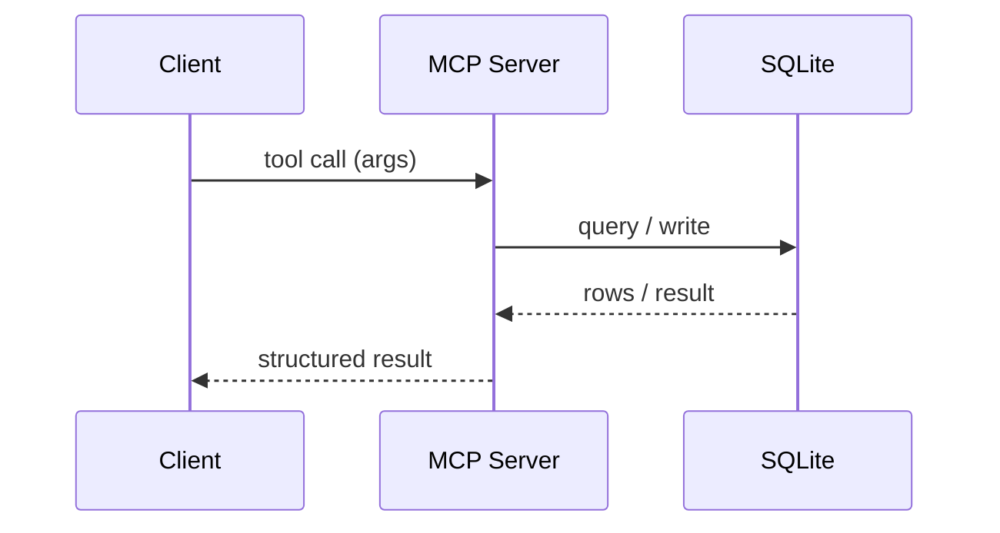

# Architecture Docs & Diagrams

Architecture documentation shows *how the system fits together* — the structure ADRs decide and the context index names, made visual. It is **living**: every diagram must match the code at all times, and a structural change updates its diagram in the same change (see `rules/maintenance-invariant.md`).

Diagrams are authored in **Mermaid** so they live in version control as text, diff cleanly in PRs, and render in most viewers — no binary image drift.

## Where it lives

- **Small project:** a single `docs/architecture.md` holding all diagrams.
- **Grown project:** an `docs/architecture/` directory with `index.md` + one file per view, organized by the same semantic-index contract as the context index (`rules/semantic-index.md`). Split when the single file passes ~200 lines or mixes unrelated views.

The architecture index (`index.md`, OKF reserved listing, no frontmatter) is reachable from the bundle-root `docs/index.md`. Each view file is a standalone **OKF concept** (`type: Architecture View`): frontmatter, then a single `#` H1, then `##` sections.

## The standard views

Cover the views the system actually has — don't invent diagrams for their own sake. Common ones:

| View | Mermaid type | Answers |
|---|---|---|
| **Context / high-level** | `flowchart` / `graph` | What are the major components and how do they connect to the outside world? |
| **Data model** | `erDiagram` | What entities exist and how do they relate? (schema, FKs, cardinality) |
| **Module layout** | `flowchart` | How is the code organized into modules and what depends on what? |
| **Process / data flow** | `flowchart` with direction | How does data move through a key operation (ingest, backfill, request)? |
| **Tool-calling / request flow** | `sequenceDiagram` | How does a request actually execute across actors over time? |
| **State** | `stateDiagram-v2` | What states does an entity move through? (lifecycles, retention) |

## Per-view instrument binding (which views are checked vs inspection)

"Living — must match code" is only real for a view that has an instrument keeping it honest; the rest rely on the no-drift discipline (inspection), which a constraint-without-an-instrument is a vibe. State, per view, how drift is caught — and prefer a deterministic check where one exists:

| View | Drift caught by | Kind |
|---|---|---|
| **Module layout** | a **dependency-conformance check** if your project has one (ArchUnit · dependency-cruiser · Deptrac · import-linter) on a committed ruleset | deterministic |
| **Data model** | a schema/migration diff or ORM-schema check, where one exists | partial |
| **Context / module / component** | **distill-from-code** where an oracle exists — generate the view from the dependency graph rather than hand-drawing it, so it cannot drift from the imports it depicts | deterministic where wired |
| **Process / sequence / state** | the no-drift maintenance rule (review/inspection) — no deterministic oracle | inspection |

Where a deterministic oracle exists, **prefer distilling the view from code** over hand-drawing it; reserve inspection for the views that genuinely have no oracle (the judgement residue), and say so per view rather than asserting "must match code" uniformly. A structural conformance rule SHOULD link back to the **ADR** that motivated it (the rule's ADR is its provenance; the ADR's fitness function is its instrument — `rules/adr-conventions.md` rule 6).

## Completeness checklist (arc42 / C4 / ISO-42010 as vocabulary, not a new index)

The bundle's *index* stays as defined above. Borrow the established frameworks only as a **completeness checklist + shared vocabulary** — not a competing layout: does the architecture cover context/scope, building-block (container/component) structure, runtime/dynamic behavior, deployment, cross-cutting concepts, the decision trail (ADRs), **quality requirements / NFRs** (the quality-attribute scenarios — see `rules/prd-conventions.md`), risks, and glossary? Use **C4** levels (context → container → component) as the zoom vocabulary for the structural views, and **ISO-42010**'s concern→view traceability as the discipline that every stakeholder concern is framed by at least one view. Adopt the names and the checklist; do not import arc42's 12-section template as a parallel index — the existing index, typed views, and ADRs already cover it. Provenance (instrumentalized, not invented): arc42 (STARKE; HRUSCHKA), C4 (BROWN), ISO/IEC/IEEE 42010, Views-and-Beyond (CLEMENTS et al., SEI).

## Tool-calling / sequence diagrams (when applicable)

When the system's behaviour is best understood as a *conversation between actors over time* — an MCP/tool call, an agent invoking tools, a client→server→DB round trip — use a `sequenceDiagram` to make the flow concrete. Show the actors as participants and each call/return as a message. This is the clearest way to evidence "how it actually works" for tool-driven or multi-actor systems.

Include a sequence diagram only where it earns its place — a tool surface, a lifecycle with ordering, a non-obvious multi-step flow. Skip it for trivially linear calls.

## Rules

1. **Mermaid, in-repo, text.** No exported PNG/SVG that can silently drift from the code.
2. **No-drift.** A change to schema, data flow, module layout, or a component relationship updates the relevant diagram(s) in the *same* change. A structural PR with a stale diagram is incomplete.
3. **Use context-index vocabulary.** Name nodes and participants with the project's domain/module terms, not ad-hoc labels — diagrams and prose must agree.
4. **One view per diagram.** Don't cram the data model and the request flow into one graph. Split by concern; index each.
5. **Indexed.** Every view file is listed in the architecture index, which is listed in the top-level Docs index.

## Anti-patterns

- A diagram that contradicts the code — worse than no diagram, because it misleads with authority.
- Screenshot/exported-image diagrams that can't diff and rot immediately.
- A single mega-diagram trying to show everything at once.
- Diagrams added but never wired into the index (orphans).
