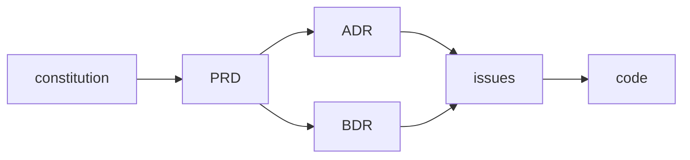

# Doc trail & document map

## Doc trail

Every change follows this chain, from foundational source of truth down to code:

| Artifact | Role |
|---|---|
| **constitution** | Foundational source of truth: what the product is, core data model, non-negotiables. All other docs sit under it. |
| **PRD** | What the system must do and why — feature/product requirement spec. |
| **ADR** | How the system is structured — architectural/implementation decision and rationale. |
| **BDR** | What the system must observably do — inputs, outputs, side effects, Given/When/Then scenarios — **and how each is tested** (the Test Design matrix; single home for "how to test", an execution issue links it). |
| **issues** | Execution slices — discrete units of work that trace back to ADRs/BDRs. |
| **code** | Implementation — every behavior, structure, and interface specified above, realized. |

---

## Document map

| Type | Lives in | Purpose | Mutability |
|---|---|---|---|
| Project guide | `CLAUDE.md` / `README.md` (root) | Entry point: scope, stack, docs index, mandatory workflows | Live — edit freely |
| Constitution | `docs/constitution.md` | Foundational source of truth: product scope, data model, non-negotiables | Append-only once ratified (amendment log) |
| Context index | `docs/context/index.md` + group files | Domain & module vocabulary, semantically grouped | Live — edit freely |
| Glossary | `docs/context/glossary.md` | Terms & acronyms defined once, in the doc language (acronym headwords as-is) | Live — edit freely |
| Architecture | `docs/architecture.md` or `docs/architecture/` + index | Living Mermaid diagrams: structure, data model, flows, tool-calling | Live — must match code |
| ADR | `docs/adr/NNNN-slug.md` | One architectural/implementation decision | Append-only (supersede) |
| BDR | `docs/bdr/NNNN-slug.md` | One observable-behavior decision | Append-only (supersede or amend) |
| PRD | `docs/prd/NNNN-slug.md` | One feature/product requirement spec | Append-only once accepted |
| Issue | `docs/issues/NNNN-slug.md` | Tracker mirror (body), one per ticket | Body editable; published copy follows |
| Research | `docs/research/NNNN-<slug>.md` (single file, no subfolder; sequential number leads, date in frontmatter `timestamp`; ends in `# References`) | External evidence with sourced claims | Append-only (evidence is dated) |

Each directory carries its own `index.md` listing (OKF §6, no frontmatter). The project guide's "Docs index" links to the bundle-root `docs/index.md`. See `rules/semantic-index.md` for the indexing contract.
