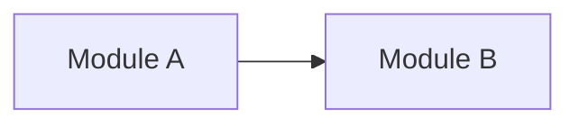

# <View name>

<!-- One view per concern (ADR 0036). `kind` is CLI-set (`new view --kind ...`) from the
     closed vocabulary context | container | component | flow | sequence | state |
     data-model | deployment; the generated architecture index sorts by it in C4/arc42
     zoom order. Pick the Mermaid type by kind: context/container/component/flow ->
     flowchart; sequence -> sequenceDiagram; state -> stateDiagram-v2; data-model ->
     erDiagram; deployment -> flowchart. Name nodes with context-index vocabulary. -->

{{ORIENTATION_SENTENCE}}

<!-- Replace the diagram above with this view's real one, keeping the Mermaid type its
     kind calls for. Mermaid only -- no images, no ASCII art. -->

## Drift instrument

<!-- "Living — must match code" is only real with an instrument. State how drift is
     caught for THIS view: a dependency-conformance check / schema diff (deterministic),
     distilled-from-code, or the no-drift maintenance rule (inspection) — and link the
     ADR that motivated any conformance rule. -->

Drift caught by: {{INSTRUMENT}}
