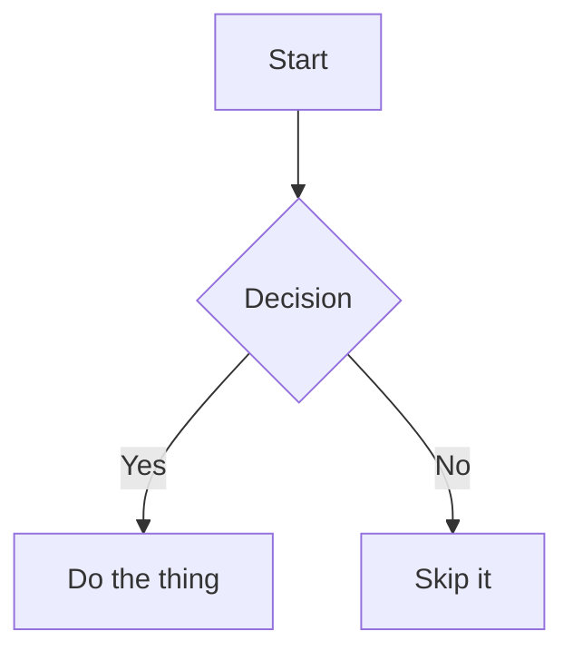
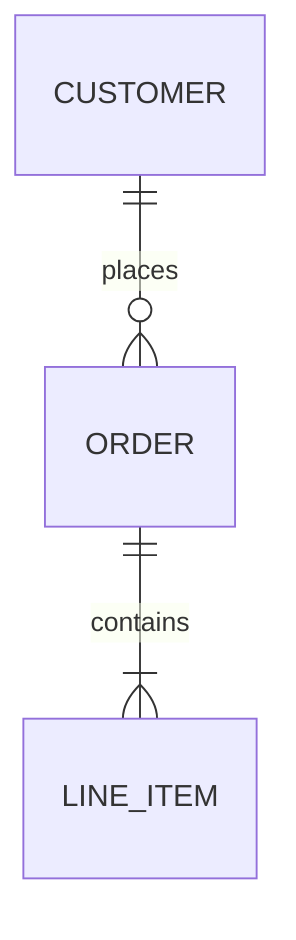

# Mermaid fixture — valid diagrams

A flowchart:

```mermaid
flowchart TD
  A[Start] --> B{Decision}
  B -->|Yes| C[Do the thing]
  B -->|No| D[Skip it]
```

An entity-relationship diagram:

```mermaid
erDiagram
  CUSTOMER ||--o{ ORDER : places
  ORDER ||--|{ LINE_ITEM : contains
```
